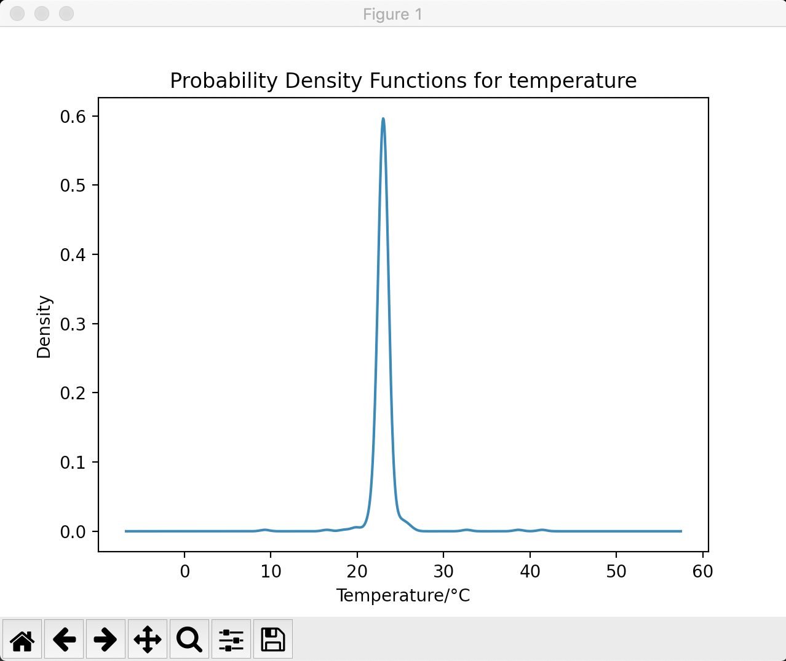

TO: Micheal Hurish 

FROM: Alexis Gonzalez and Zhengjiang Chen

SUBJECT: Mini-project Report

DATE: September 17, 2020

CC: Alan Pisano and Osama Alshaykh

PURPOSE
	For this project we will talk about the efficiency of sensors used to test temperature, occupancy, and CO2 levels.

SUMMARY 
	Task 0: The greeting string issued by the server to the client is: ECE Senior Capstone IoT simulator
	Task 2:
 

	Task 2: The time interval distribution mimics a binomial curve。 
  
	Task 3: Bad temperature data does not always indicate a bad sensor, for example, if someone were to breathe on the sensor or 
	hold it in their hands that would affect the temperature being read by the sensor but that would not mean the actual room temperature is that value. 		Possible bounds on the temperature for the different rooms would be for labs, there 
	could be a chemical that needs to be kept at a certain temperature, or for the office one person maybe 
	like their office really hot or really cold. For the classroom, the temperature is bounded by the time of year, 
	whether a window is open if that room has AC or heating. 
  
  
	Task 4: This simulation reflects the real world because businesses or people would want to monitor the temperature, 
	occupancy, and CO2 levels for their building for energy efficiency, space capacities for events, and tracking airflow 
	in the room. For instance, a company could lose a lot of money if there are rooms in which the AC is constantly blasting 
	or the heater is constantly running. Then in terms of COVID reality, businesses wouldn’t want to host a meeting for 20 
	people in a room that can only hold 14 same goes for airflow because if too much CO2 is producing in that room that could 
	indicate there are too many people in that room which could increase the spread of COVID. The simulation fails to account 
	for foot traffic, say for instance a room has an occupancy of 12 and the sensor registers 13 people however 2 people could have 
	been in the room for 2 hours then left, and after they left suppose 11 people ten went into the same room. So the sensor would 
	register 13 people in the room without accounting for people who left the room or when they left the room. It fails to account 
	for how much people breathe, say, for instance, you have allergies so you are breathing heavier, the room only accounts for how 
	much CO2 is being produced. This program could be improved if sensors reach out to the server when they have data because then 
	the program won’t be using memory, storage, or power by running when there is no data being registered by the sensors. This project 
	was a struggle, and my partner had a hard time adjusting to using Python, we also had no previous experience using git or GitHub. 
	The learning curve for this project was steep, but we persevere and now we have a deeper understanding of these programs. 

